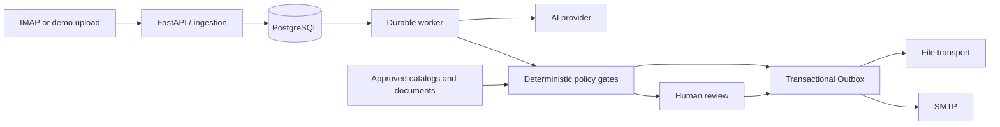

# AI Sales Agent

> A safety-first, human-in-the-loop email automation platform for B2B sales workflows.


AI Sales Agent connects an inbox, structured commercial data, and optional AI
models without handing control of business-critical decisions to the model. AI
can classify messages, extract intent, and draft language; deterministic code
controls recipients, prices, attachments, approvals, rate limits, and delivery.

The repository ships with a fully local demo configuration: stubbed AI, file
delivery, fictional contacts and products, and automatic sending disabled.

## Why this project?

Most email-agent demos stop at “generate a reply.” Real sales operations also
need durable state, threading, approval, pricing rules, attachment validation,
retries, and a reliable answer to a more important question: **is this message
actually allowed to send?**

AI Sales Agent treats those requirements as first-class application behavior.

| Capability | What it does |
| --- | --- |
| Inbox processing | Ingests inbound mail, preserves threading, detects bounces and automated replies |
| AI-assisted triage | Extracts intent and prepares drafts through a stub or Anthropic provider |
| Quotations | Resolves products, applies structured price policies, freezes quotes, and routes uncertainty to review |
| Product documents | Sends approved catalog or COA files only after deterministic lookup and fingerprint checks |
| Human handoff | Provides review, editing, forwarding, assignment, and explicit approval flows |
| Safe delivery | Uses a durable Outbox with idempotency, recipient checks, pacing, suppression, and recovery |
| Operations | Includes a dashboard, audit events, import tools, disposition review, and reactivation campaigns |

## Architecture



The API, worker, and IMAP poller are separate processes sharing PostgreSQL.
Business workflows live in capability-focused modules, while database
constraints and business keys keep retries idempotent. See
[docs/architecture.md](docs/architecture.md) for module ownership and dependency
boundaries.

## Quick start

### Requirements

- Docker Desktop or Docker Engine with Compose
- PowerShell 7 for the bundled demo script
- Git

### 1. Clone and start

```powershell
git clone https://github.com/Mrchou001012/AIEmail.git
cd AIEmail
./scripts/bootstrap.ps1
```

The bootstrap script copies `.env.example` to `.env`, builds the containers,
runs Alembic migrations, and waits for the services to become healthy.

Open:

- API documentation: <http://localhost:8000/docs>
- Operations dashboard: <http://localhost:8000/dashboard>
- Health endpoint: <http://localhost:8000/health>

The demo administrator credentials are `admin` / `change-me-locally`. They are
for localhost only.

### 2. Generate a demo email

```powershell
./scripts/demo.ps1
```

The script seeds fictional data, queues an outreach job, waits for the worker,
and prints the path of the generated RFC-compliant `.eml` file under
`runtime/demo_outbox/`.

Useful troubleshooting commands:

```powershell
docker compose ps
docker compose logs --tail 200 api worker
```

### Manual Compose setup

If you do not want to use the bootstrap script:

```powershell
Copy-Item .env.example .env
docker compose build
docker compose run --rm migrate
docker compose up -d --wait
```

## Demo safety defaults

The checked-in configuration is intentionally inert:

```dotenv
AI_PROVIDER=stub
MAIL_TRANSPORT=file
SAFE_MODE=true
AUTO_SEND_ENABLED=false
RECIPIENT_ALLOWLIST=internal@example.com
PRODUCT_LIST_AUTO_SEND_ENABLED=false
QUOTE_AUTO_SEND_ENABLED=false
COA_AUTO_SEND_ENABLED=false
IMAP_SYNC_ENABLED=false
```

With these defaults, the application does not connect to a live mailbox or send
external email. Generated messages remain local files.

## Core workflows

### Inbound email

Inbound messages are normalized, de-duplicated, linked to existing threads, and
classified. Straightforward messages can proceed to a prepared response;
counteroffers, ambiguous identities, risky requests, missing data, and low
confidence are routed to a human handoff.

### Quotations

Price policies are structured database records rather than prompt text. The
application resolves the product and quantity, computes the permitted quote,
freezes the result, and re-checks send eligibility before delivery. Unsupported
or ambiguous requests remain reviewable instead of being guessed.

### Product lists and COAs

Tracked demo assets illustrate the workflow, but attachments are selected by
deterministic code. COA delivery validates the catalog match, file path, hash,
and current file contents before staging an email. Missing or changed documents
fail closed without stopping unrelated workflows.

### Human review

The review UI supports draft generation, editing, assignment, recipient
replacement, forwarding, document approval, and manual replies. Approval is an
explicit application event, not an instruction hidden inside a prompt.

### Delivery and recovery

Outbound messages pass through a durable Outbox. Stable business keys prevent
duplicate work, while leases, retry state, pacing, recipient suppression, MX
checks, and an `UNKNOWN` recovery path protect delivery across worker failures.

## Configuration

Copy `.env.example` to `.env` and change values locally. Important groups are:

| Area | Key settings |
| --- | --- |
| AI | `AI_PROVIDER`, `ANTHROPIC_API_KEY`, `ANTHROPIC_MODEL` |
| Mail | `MAIL_TRANSPORT`, `GMAIL_ADDRESS`, `GMAIL_APP_PASSWORD`, `IMAP_SYNC_ENABLED` |
| Send policy | `SAFE_MODE`, `AUTO_SEND_ENABLED`, `RECIPIENT_ALLOWLIST`, pacing limits |
| Content | `CONTENT_DIR`, `PRODUCT_CATALOG_PATH`, `PRODUCT_ALIASES_PATH` |
| Documents | `NAS_KNOWLEDGE_*`, `COA_CATALOG_*`, `COA_AUTO_SEND_ENABLED` |
| Optional retrieval | `RAG_ENABLED`, embedding and reranking settings |
| Administration | `ADMIN_USERNAME`, `ADMIN_PASSWORD`, `PUBLIC_BASE_URL` |

The tracked YAML, PDF, signatures, spreadsheet templates, addresses, and
product identifiers are fictional fixtures. Use environment-configured paths
for private catalogs and company content.

## Project layout

```text
app/
  inbound/        ingestion, matching, bounces, automated replies
  quotations/     quote context, preparation, rendering, approval
  catalogs/       product data and product-list workflows
  coa/            COA catalog, verification, preview, delivery
  handoffs/       human review, drafts, forwarding, continuation
  delivery/       guards, pacing, sending, and recovery
  dispositions/   inbound classification, apply, and rollback
  research/       optional bounded company research
  common/         shared transactions, audit, identity, threading
config/           public demo catalogs, aliases, policy, and content
assets/           demo email fixtures and import templates
scripts/          setup, verification, imports, and maintenance tools
tests/            unit, architecture, workflow, and integration tests
```

`app/services.py` is a compatibility facade. New workflow implementation belongs
in the capability module that owns it.

## Development

Python 3.12 or newer is required.

```powershell
python -m venv .venv
./.venv/Scripts/python -m pip install -e ".[dev]"
Copy-Item .env.example .env
```

Run the fast local checks:

```powershell
./.venv/Scripts/python -m ruff check .
./.venv/Scripts/python -m pytest -m "not integration"
```

PostgreSQL integration tests require an explicitly configured database whose
name ends with `_test`. Never point the test suite at a production database.

## Production notes

Docker Compose in this repository is intended for local development and
isolated verification. A production deployment should use a dedicated
PostgreSQL database, run `alembic upgrade head` before application startup, and
operate the API, worker, and IMAP poller as separately supervised processes.

Before enabling live delivery:

1. Replace all demo credentials and content.
2. Verify mailbox, database, and document-source permissions.
3. Keep document mounts read-only.
4. Test with file delivery and an internal recipient allowlist.
5. Enable workflow-specific auto-send switches independently.
6. Monitor the Outbox, jobs, audit events, and recovery states.

## Contributing

Issues and pull requests are welcome. For code changes:

1. Keep deterministic decisions separate from AI-generated prose.
2. Add behavior to the owning capability module, not the compatibility facade.
3. Include focused tests and run Ruff before opening a pull request.
4. Use fictional domains, identities, products, and documents in fixtures.
5. Never include credentials, customer messages, or private operational data in
   an issue, test, log, screenshot, or commit.

This project is evolving quickly. Bug reports that include a minimal,
sanitized reproduction are especially useful.

## Security and data handling

Do not use real customer data in the public repository. Keep secrets in the
ignored `.env` file or a secret manager, and keep organization-specific
catalogs, signatures, infrastructure paths, and runbooks outside Git.

If you discover a security issue, report it privately to the repository owner
instead of opening a public issue.
